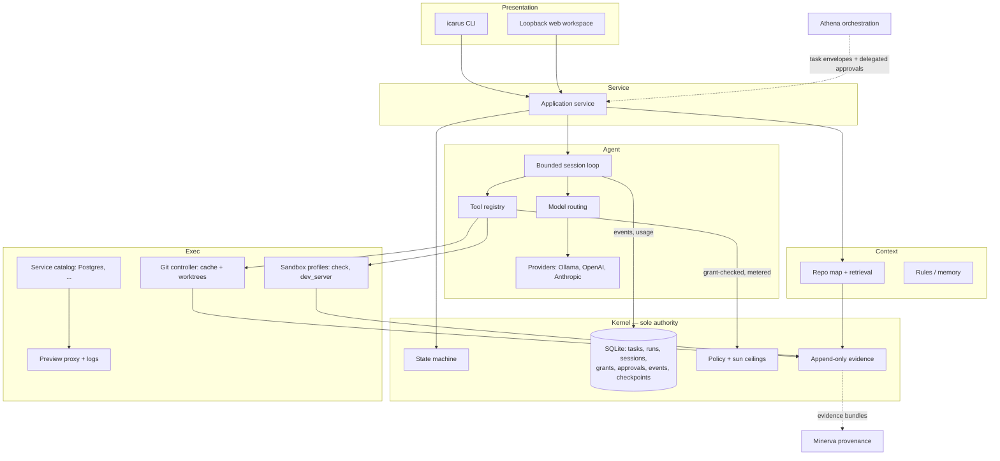

# Icarus: from provenance kernel to governed AI software factory

This document is the output of a full repository review performed at
`34004c3d1f364dbfdb43d53228c7e6e0a399a58e` (main, 2026-07-25). It supersedes the
strategic framing of `docs/ROADMAP.md` M2–M7 while preserving every accepted ADR
as history. It changes no source code. Every claim below is labeled **verified**
(observed in the repository at HEAD), **inferred** (my judgment from evidence),
or **proposed** (a decision this document makes).

> **Current-direction note (2026-07-30):**
> [ADR 0036](adr/0036-proof-carrying-software-factory-product-direction.md)
> supersedes this document's current product positioning and sequence. This
> remains the point-in-time Fable audit at its named base commit; its historical
> evidence, accepted-ADR references, and reserved ADR numbers are not rewritten.
> Icarus now intentionally targets competitive Cursor/VS Code, Replit, and
> Supabase outcomes through its proof-carrying authority kernel and integrated
> surfaces rather than by rebuilding editor or backend engines.

---

## 1. Executive verdict

**What Icarus should become.** Icarus should become the first *governed AI
software factory*: a local-first system you hand a task to — not a cursor you
babysit — that plans, negotiates an explicit capability envelope, executes a
bounded agent loop in an isolated workspace, produces a multi-file patch set,
provisions the services the app needs, verifies in a fail-closed sandbox, shows
you evidence instead of vibes, and lands the result on a branch you can merge,
roll back, or hand to a fleet. Its slogan is already in the README: *"Fly high.
Know the ceiling. Land safely."* The product is delegation with receipts.

**The primary user.** A single technical operator (Kevin first, then people
like him: senior engineers, consultants, and small teams) who delegates whole
tasks to AI across multiple repositories and needs to *trust results they did
not watch being produced*. Not the interactive-IDE user Cursor already serves
well; the operator who wants ten tasks done overnight and provable answers to
"what did the agent see, do, spend, and change?"

**Center of gravity.** An AI software factory — specifically the **execution
plane** of a larger personal platform (Athena = orchestration, Minerva =
knowledge, Icarus = execution). Not a browser IDE. Not a hosted platform. Not
an agent framework SDK.

**The unique wedge.** *Provable autonomy.* Icarus is the only tool in this
category where every agent action is capability-scoped, digest-approved,
budget-metered, evidence-bound, replay-safe, and reversible. Cursor optimizes
interactive velocity; Replit optimizes zero-setup creation; Supabase optimizes
backend primitives. None of them can answer an auditor — or a cautious operator
— with a cryptographic chain of custody from context manifest to landed diff.
The safety kernel that today feels like overhead *is the moat*, provided the
capability riding on it stops being trivial.

**The three most important pillars.**

1. **Trust fabric** (exists, extend): digest-bound approvals, append-only
   evidence, sun-ceiling budgets, fail-closed sandbox, crash-safe recovery.
2. **Governed Cursor-class capability** (build now): multi-file patch sets, a
   bounded agent tool loop, context intelligence, model routing, and a landing
   ramp (branch/commit/PR) — all inside the trust fabric.
3. **Runnable reality** (build next): environments, previews, templates, and an
   orchestrated local service catalog (Postgres first) so Icarus outputs are
   *running applications*, not stranded diffs.

**The most important things not to build yet.** Hosted multi-tenant cloud;
deployment infrastructure; collaboration/multi-user; Kubernetes; a proprietary
auth/storage/realtime service (orchestrate containers and templates instead);
an embeddings database service; a plugin marketplace; fleet scheduling inside
Icarus (that is Athena's job); browser-held provider keys; telemetry.

**Final recommendation.** Stop widening the observation surface and widen the
mutation surface. The last eight merged slices (ADRs 0014–0021) bounded *read*
paths with extraordinary care while the write path remained one find/replace in
one file. Supersede ADR 0003 with a transactional multi-file **PatchSet** model,
add a bounded **agent session loop** with a host-owned tool registry and
explicit **capability grants**, add the **landing ramp** (branch + commit + PR
emission), then previews and the app platform — in that order, each under a new
ADR, each keeping the existing evidence discipline. Resolve ADR 0010 by removing
the inherited OpenCode workflow and rotating its secret. Ship the factory.

---

## 2. Verified current-state audit

Everything in this section is **verified** at HEAD unless labeled otherwise.

### 2.1 Shape

- pnpm/TypeScript monorepo, four packages: `@icarus/core` (~10.6k LOC across 20
  files), `@icarus/cli`, `@icarus/api`, `@icarus/workspace` (React 19 + Vite,
  no router/state library). Root `package.json` describes the product as
  "Local-first, guarded AI software factory". TypeScript 6.0.3, Biome, Vitest 4,
  sole core runtime dependency `better-sqlite3`.
- Entire history is 40 commits spanning 2026-07-19 → 2026-07-22, beginning with
  one 92-file, 12.7k-line founding commit (`f4e5236`). Five PRs from `agent/*`
  and `sol/*` branches; strict conventional commits; a repeated per-slice ritual
  of "docs: define → feat: add → test: harden → docs: record evidence".
  **Inferred:** the repository is itself an artifact of an agent-directed
  development loop — that loop is part of the IP.

### 2.2 The kernel (control plane)

- **State machine:** 14 run states with a closed transition table
  (`packages/core/src/state-machine.ts:4-19`); the store's generic `transition()`
  permits only `running→verifying` and `*→cancelling` ungated — everything else
  requires a dedicated approval/evidence method (`GATED_TRANSITION`,
  `store.ts:1488-1494`). There is **no verify→replan edge**: a failed check
  dead-ends in `awaiting_review`; the loop is one-shot.
- **SQLite schema (v1):** `repositories`, `projects`, `runs`, `run_events`
  (append-only, contiguity-proven), `approvals`, `operations`, `checkpoints`;
  WAL, `synchronous=FULL`, foreign keys, 0600 file mode; partial unique indexes
  enforce one active run per project and one started operation per run
  (`store.ts:164-266`).
- **Approvals:** five kinds (`egress|plan|review|rollback|restore`), each bound
  to an exact digest (context SHA, plan-manifest SHA, diff SHA, checkpoint SHA)
  with actor validation and `STALE_APPROVAL` on drift (`store.ts:819-874,
  2696-2700`). Plan digest binds task + baseCommit + contextSha256 + target +
  provider + checks + sandbox + ceiling + plan under `POLICY_VERSION "m1-v1"`
  (`policy.ts:50-76`).
- **Budgets ("sun ceiling"):** reservation-based admission for every operation —
  tool calls, runtime, tokens, cost — settled against actuals; interrupted work
  is charged its full reservation; a single emergency class
  (`cancellation.recovery`, 120 s × 2 attempts, $0) is the only carve-out
  (`store.ts:2030-2293`; `types.ts:24-38`). Defaults: 40 tool calls, 20 min,
  192 KiB context, 100k tokens, **$2**, **1 file**, 256 KiB file/diff.
- **Leases and recovery:** kernel `flock` leases with `/proc` liveness
  (Linux-only), close-only release, protocol v2 (`lease.ts`); `failed` runs
  carry `resume_state`; resume re-proves plan approval and replays only into
  persisted safe stages.

### 2.3 The mutation boundary

- `SunCeiling.maxFilesChanged` is the **literal type `1`** (`types.ts:31`); the
  edit is one `EditProposal {path, expectedPreimageSha256, findText,
  replaceText, rationale}` with exactly-once match (`policy.ts:411-463`).
- `atomicWriteUtf8` can only overwrite an existing tracked regular UTF-8 file —
  no create, delete, rename, or mode change is expressible (`git.ts:768-807`).
- The literal-`1` invariant is load-bearing in at least six layers: the type,
  the ceiling assert, the edit schema, the write primitive, verification
  (`changedPaths.length === 1`), API diff review (single-target parser,
  `present.ts:599-601`), and the browser validator
  (`project-page-nav.ts:167`). **Inferred:** widening it is an architectural
  event, not a config change — and the codebase was visibly built expecting
  that event.
- **No exit ramp:** a `completed` run's only legal successor is `rolling_back`.
  No commit, branch, push, or PR path exists anywhere; execution-shaped API
  routes (`commit, merge, push, deploy`, …) exist only as 404 assertions and a
  security-check regex forbidding their reappearance.

### 2.4 Execution plane

- Private per-run workspace: bare `clone --no-local --no-hardlinks` cache +
  detached, locked worktree under `ICARUS_HOME/runs/<uuid>/`; hooks nulled,
  filters/alternates/hook-command configs fail closed
  (`GIT_UNSAFE_CONFIGURATION`); source repo identity pinned by device+inode and
  never mutated (every integration test asserts an unchanged full fingerprint).
- Docker check sandbox: digest-pinned image, `--pull never`, `--network none`,
  `--read-only`, `--cap-drop ALL`, no-new-privileges, user 65534, memory=swap,
  label-owned cleanup with re-inspection; missing daemon/seccomp/image ⇒ checks
  are `unavailable`, never passed; a timed-out child that traps SIGTERM and
  exits 0 still fails (`sandbox.ts`; `tests/unit/sandbox-wire.test.ts`).
- Read-only snapshot rebuilt from git objects per run with secret screening;
  16 MiB/file, 64 MiB/tree ceilings; whole-tree scan every run (**verified**) —
  a scalability wall for large repos (**inferred**).

### 2.5 Context and providers

- Deterministic context recipe: sorted model-visible path map (≤2,000), target,
  ancestor `AGENTS.md` chain, five fixed seed files; every entry SHA-256'd into
  a manifest whose digest anchors egress and plan approvals; repository text is
  fenced as `BEGIN UNTRUSTED REPOSITORY DATA` with an explicit no-authority
  header (`context.ts:592-724`). No retrieval, no search, no language
  detection.
- Secret policy is fail-closed and fatal in context/snapshot paths (any tracked
  secret-shaped file blocks all runs on that repo — no waiver mechanism), with
  span redaction as defense-in-depth for logs/evidence.
- Providers: exactly two adapters behind a one-verb port
  (`generateStructured`) — Ollama `/api/chat` (loopback plain-HTTP only) and
  OpenAI Responses (`store:false`, `tools:[]`, credential origin-pinned).
  Capabilities hardcode `toolSupport: false`, `streamingSupport: false`
  (`types.ts:113-124`). No Anthropic adapter. Two provider calls per run: one
  plan, one edit.

### 2.6 Presentation

- CLI owns the full lifecycle (`run plan/approve-egress/approve/status/history/
  review/rollback/restore/resume/cancel`), all approvals digest-bound by flag.
- Loopback-only API (127.0.0.1, Host/Origin validation, no CORS, 64 KiB bodies,
  8 MiB pre-serialized responses) + review-only React workspace. The browser
  can register/preview/draft/plan (loopback Ollama only) and read evidence; it
  has **no approval or execution route**, `action.allowed` is hardcoded
  `false`, and every view is bounded (12-row pages, 200-event tails, 4-page
  windows, 256 KiB rehashed diff display).
- The API presenter re-hashes the persisted diff before display and fully
  re-parses the patch, refusing malformed evidence — presentation re-verifies
  its own evidence (**verified**, and rare in the industry — **inferred**).

### 2.7 Tests, evals, CI

- 39 test files (~13.5k lines): unit, integration (real Docker containment
  probing uid/caps/seccomp/no-network including CGNAT, lifecycle-across-restart,
  recovery, ceilings), security (path/secret policy, CI byte-pinning,
  regressions incl. prompt-injection fixture), provider contract tests, native
  portability. `scripts/security-check.mjs` computes ~60 named static
  assertions over production source; `.only/.skip` are build failures.
- Eval harness: manifest schema v2, ten scenario classes, ten required
  measures; five classes execute through production code with deterministic
  providers; five (multi-file repair, refactor, failing-test diagnosis,
  security review, codebase explanation) are **honestly `unsupported`** with
  pinned fixture contracts already in the repo.
- CI: one Linux job, SHA-pinned actions, whole-file workflow digests, pinned
  actionlint with negative self-test. Native macOS/Windows lane exists with
  **zero recorded runs** (ADR 0022 Proposed).

### 2.8 Check-suite status at review time (this environment)

| Check | Result | Notes |
| --- | --- | --- |
| `pnpm format:check` | ✅ passed | 97 files |
| `pnpm lint` | ✅ passed | exit 0; 26 info-level diagnostics |
| `pnpm typecheck` | ✅ passed | node + workspace |
| `pnpm test` | ⚠️ 175/177 | 2 failures are **environment artifacts**: `git-file-safety` atomic-write tests force `EACCES` via `chmod 0o500`, which this root-user container ignores |
| `pnpm build` | ✅ passed | tsc + Vite |
| `pnpm test:integration` | ⚠️ 39/44 | 5 failures **environment-limited**: the digest-pinned `python:3.12-slim` sandbox image cannot be pulled through this network proxy; Icarus correctly failed closed (`SANDBOX_RECONCILIATION_FAILED` / image-unavailable) |
| `pnpm eval` | ⚠️ environment-limited | golden-path cases require the same sandbox image; evaluator honestly reported `not_measured`, not passes |
| `pnpm security` | ✅ passed | 133 tests + all static assertions true, `failed: []` |
| `pnpm workflow:lint` | ✅ passed | after `pnpm workflow:setup` (actionlint download) |
| `pnpm check` | ⛔ not attested | would fail at the environment-limited stages above; **not** claimed passing |
| `git diff --check` | ✅ passed | clean |

Node 22.23.1 was provisioned to satisfy `engines` (the container shipped
22.22.2; `engine-strict=true` correctly refused install). Repo-recorded
evidence (docs/PLANS.md, docs/README.md) shows the full suite green on hosted
CI at exact commits, most recently across PRs #1–#5. **Inferred:** no real
regression exists at HEAD; this environment simply cannot exercise
root-sensitive and image-dependent paths.

### 2.9 Release holds (verified)

1. **ADR 0010** — inherited `.github/workflows/opencode.yml`: public
   comment-triggered (`/oc`), `id-token: write`, `OPENCODE_API_KEY` secret,
   mutable `anomalyco/opencode/github@latest`. Blocks M0/M1/M3 release status
   pending Kevin's decision.
2. **ADR 0022** — native macOS/Windows acceptance workflow registered, zero
   runs dispatched.
3. Approval-index migration against existing non-test state is operator-gated
   (`ICARUS_APPROVE_SCHEMA_MIGRATION=approval-index-v1`).
4. `main` has no branch protection (documented as an open operator choice).

---

## 3. Keep / evolve / replace / defer ledger

| Current capability / design | Evidence | Verdict | Why | Target replacement | Migration risk | Required ADR / eval |
| --- | --- | --- | --- | --- | --- | --- |
| Digest-bound approval chain (egress/plan/review/rollback/restore) | store.ts:819-874 | **Keep** | The moat. Nothing else in the category has it | Extend digests to cover capability grants and patch sets | Low | ADR 0023/0025 extend digest contents |
| Append-only event ledger + verification provenance | store.ts:219-227; verification-provenance.ts | **Keep** | Evidence spine; replay + audit | Add event kinds for tool calls, sessions, services | Low — additive | Eval: replay fidelity |
| Reservation-based sun-ceiling budgets | store.ts:2030-2293 | **Keep** | Already shaped to host an agent loop | Add per-session iteration ceilings; model-routing cost classes | Low | ADR 0024 |
| Fail-closed Docker check sandbox | sandbox.ts; ADR 0007 | **Keep / evolve** | Correct default; needs a second metered profile for dev servers | Add `dev_server` sandbox profile (loopback-published port, still no egress) | Medium | ADR 0028 + containment tests |
| Private git cache + detached worktree | git.ts:473-658; ADR 0003 | **Keep** | Correct isolation; already multi-file-capable at the git layer | Unchanged | None | — |
| One-file exact-replacement mutation boundary | types.ts:31; policy.ts:256-260; ADR 0003 | **Replace** | The single largest gap to any real product; deliberately built as a fuse | **PatchSet** transactional multi-file model (§7.3) | High — touches ~6 layers + pinned tests | **ADR 0023 supersedes 0003**; activates `multi_file_bug_repair` eval class |
| One-shot plan→edit provider contract (no loop) | state-machine.ts (no verify→replan edge); provider.ts | **Replace** | Caps autonomy at one shot; no repair on failed checks | Bounded **AgentSession** loop with tool registry (§8) | High | ADR 0024 |
| `toolSupport:false, streamingSupport:false` literal capabilities | types.ts:113-124 | **Replace** | Blocks tool-native models (incl. Anthropic) | Capability metadata per adapter; tool-call generation verb | Medium | ADR 0026 |
| Two providers (Ollama, OpenAI) | providers.ts:334-342 | **Evolve** | Thinnest layer (~150 LOC/adapter); Anthropic is the obvious missing flagship | Add Anthropic (Messages, tool use) first; then per-role routing | Low | ADR 0026 + production-adapter contract tests |
| No write-back / no exit ramp from `completed` | state-machine.ts:12; absence of commit path | **Replace** | Output stranded in a private worktree enters no real workflow | **Landing plane**: branch + commit in private cache, push behind approval, PR emission (§7.4) | Medium | ADR 0027 |
| Fixed deterministic context recipe (map + AGENTS.md + 5 seeds) | context.ts:664-675 | **Evolve** | Right skeleton, insufficient for real tasks | Deterministic retrieval v2 (`rg`, stack detection, dep-graph), then measured semantic retrieval | Medium | M2 evals first (roadmap already requires this — keep that discipline) |
| Whole-tree secret scan per run | context.ts:503-544 | **Evolve** | O(repo) per run; blocks monorepos | Blob-digest-keyed scan cache keyed by `CONTEXT_AUDIT_POLICY_VERSION` | Low | Perf eval fixture |
| Fatal no-waiver secret policy (any tracked secret blocks repo) | context.ts:513-534 | **Evolve** | Fails onboarding on real repos | Per-project digest-audited waiver list, approval-gated | Medium — must not weaken default | ADR + security tests |
| Review-only browser (no approval routes) | server.ts:319-323; present.ts:775 | **Replace** | Every approval requires CLI + hand-copied SHAs; unusable beyond the author | Browser approvals bound to the same digests, single service, session-token hardening (§10) | Medium | **ADR 0029**; CSRF/token security tests |
| Loopback-only workspace, no auth | THREAT_MODEL residual | **Keep (for now)** | Correct for single-operator local-first | Add local session token with browser approvals; real authn only with remote surfaces (deferred) | Low | ADR 0029 |
| 2s polling + 4-page bounded views | live-poll.ts; *-nav.ts | **Keep / evolve** | Fine for one operator; invariants map cleanly onto SSE later | SSE with same cursor/contiguity invariants when task board lands | Low | — |
| CLI as only complete record | ADR 0016-0021 pattern | **Evolve** | Good invariant (single truth), wrong ergonomics | Workspace becomes primary; CLI remains full-fidelity + automation | Low | — |
| `HEAD == baseRef` requirement (serial factory) | service.ts:909-913 | **Replace (later)** | Prevents parallel runs from one repo; worktree-per-run already supports fan-out | Pin base per task; allow N concurrent runs across branches | Medium | Phase 7 ADR |
| Milestone process: one ADR + threat rows + plan checklist per 12-row UI slice | ADRs 0015-0021 | **Evolve** | Governance is right; granularity throttles product velocity ~10× | Same ritual at *capability* granularity (one ADR per plane change, not per page bound) | None (process) | This document |
| Inherited OpenCode workflow (ADR 0010 hold) | opencode.yml | **Replace** | Live attack surface on a public repo; philosophically un-Icarus | Remove workflow + rotate/remove secret; Icarus grows its own agent automation on its own terms | None | ADR 0030 records the decision |
| Roadmap M2–M7 structure | ROADMAP.md | **Replace** | Ordering buries the critical path (multi-file + loop) behind context/UI work | Phased roadmap in §11 | None | This document supersedes; ADRs preserve history |
| Eval manifest v2 + honest `unsupported` classes | fixtures/evals; EVALS.md | **Keep** | Best-in-class honesty; fixtures for future capabilities already exist | Activate classes as capabilities land; add live-model lane | Low | Manifest v3 |
| SQLite single-file state + artifacts | ADR 0002; store.ts | **Keep** | Right for local-first; event tiering later | Add archival/compaction when event volume demands | Low | Later ADR |
| Docker-only check runtime | sandbox.ts:181 | **Keep / evolve** | `CheckRunner` seam exists; native backends later unlock macOS/Windows execution | Optional stronger isolation (gVisor/microVM) as *profiles*, not replacements | Medium | Phase 5+ ADR |

---

## 4. Product positioning and differentiation

**Proposed** positioning, grounded in the verified audit.

**vs Cursor.** Cursor is an IDE copilot: you watch, it types. Icarus is a
factory: you delegate, it returns evidence. Do not compete on editor UX,
keystroke latency, or tab-completion — that fight is lost before it starts and
it is the wrong fight. Compete on *the result of a task you didn't watch*:
capability envelopes, verified patch sets, budget receipts, rollback, and a
run ledger that survives audit. Cursor's background agents are the emerging
overlap; Icarus wins there because its entire architecture — not a feature
flag — is built for unattended trust. Where Cursor wins and Icarus should
concede: inline editing, completions, IDE integration.

**vs Replit.** Replit's wedge is zero-setup: prompt → running app in the
browser, hosted. Icarus should absorb the *capability* (templates, previews,
provisioned services) but invert the trust and locality: your machine, your
repos, your models, no platform lock-in, and every agent action evidenced.
Replit wins for beginners and instant hosting; Icarus wins for operators with
existing repositories, private code, local models, and compliance needs.

**vs Supabase (+ an AI tool).** Supabase is a backend product with a great
local CLI. Icarus should **not** rebuild auth/storage/realtime. It should
*orchestrate* backend services per-environment (Postgres first, via
Compose-style containers — exactly what ROADMAP M5 already intended) and treat
Supabase's local stack as a first-class template option. The differentiation
is not the primitives; it is that the same evidence/approval fabric governs
schema migrations and service provisioning that governs code changes.

**vs Claude Code / OpenCode.** These are interactive terminal agents:
session-scoped, memory-light, trust-by-watching. Icarus is durable
infrastructure: state in SQLite, runs that survive crashes, approvals that
bind digests, budgets that survive restarts. They are also potential *clients
and engines*: a terminal agent can drive the Icarus API, and Icarus's harness
can host frontier models those agents popularized. The inherited OpenCode
workflow (ADR 0010) should be removed — Icarus's own automation must come up
through its own trust fabric, not a comment-triggered third-party action.

**vs generic agent frameworks (LangGraph etc.).** Frameworks give you loops
and leave governance as an exercise. Icarus is the opposite: governance is
built and the loop is missing. Building the loop inside the kernel is weeks;
retrofitting the kernel under a framework is years. Do not adopt an external
agent framework for the core loop.

**vs a self-built local harness.** The honest competitor for the target user.
Icarus beats a weekend harness with the ~15k LOC nobody builds on a weekend:
crash-safe resume, reservation budgets, fail-closed sandboxing, evidence
provenance, eval fixtures. That gap must be *visible* in the product (the
evidence UI is the demo).

**Where Icarus should refuse to compete:** editor/IDE features; hosting; big
teams' collaboration suites; model training; general DevOps platforms.

---

## 5. Capability matrix

Legend — Current: ✅ built, 🟡 partial, ⛔ absent. Priority: P0 (unblocks
everything) → P3. Difficulty/Safety: L/M/H. Phase refers to §11.

| Capability | Current Icarus | Cursor parity | Replit parity | Supabase-like | Target Icarus | Priority | Difficulty | Safety risk | Depends on | Phase |
| --- | --- | --- | --- | --- | --- | --- | --- | --- | --- | --- |
| Repo registration, identity pinning | ✅ | — | — | — | Keep | — | — | — | — | done |
| Deterministic context assembly + provenance | ✅ | 🟡 (they do more, less provable) | — | — | Keep, feed loop | — | — | — | — | done |
| Deterministic search (`rg`), repo map v2, stack detection | ⛔ | ✅ | 🟡 | — | Build native | P1 | M | L | — | 4 |
| Semantic retrieval + embeddings | ⛔ | ✅ | 🟡 | — | Build only after measured baseline (keep existing discipline) | P2 | M | M | Phase 4 evals | 4+ |
| Project rules / memories / skills | 🟡 (AGENTS.md chain) | ✅ | 🟡 | — | Build native (rules + memory files with provenance) | P2 | M | M (injection) | 4 | 4 |
| **Multi-file patch sets (create/delete/rename)** | ⛔ (literal 1) | ✅ | ✅ | — | **Build native — the critical path** | **P0** | H | M | — | **1** |
| **Bounded agent loop with tools** | ⛔ (2 calls/run) | ✅ | ✅ | — | **Build native, inside kernel budgets** | **P0** | H | H | Phase 1 | **2** |
| Bounded repair loop (verify→revise) | ⛔ | ✅ | ✅ | — | Build native (iteration ceiling, evidence per attempt — event model already anticipates it) | P0 | M | M | Phase 2 | 2 |
| Test execution & interpretation | 🟡 (argv checks, no interpretation) | ✅ | ✅ | — | Evolve: check output → structured signals for the loop | P1 | M | L | 2 | 2 |
| Terminal/tool use via explicit capabilities | ⛔ (by design) | ✅ | ✅ | — | Host-owned tool registry only; never model-shell | P0 | M | H | 2 | 2 |
| Diffs, checkpoints, rollback, recovery | ✅ (single-file) | 🟡 | 🟡 | — | Generalize to tree checkpoints | P0 | M | L | 1 | 1 |
| **Landing: branch/commit/push/PR** | ⛔ | ✅ | ✅ | — | **Build native, approval-gated** | P0 | M | H | 1 | 3 |
| Model routing (local/cloud, per role) | ⛔ | ✅ | 🟡 | — | Build native: planner/coder/reviewer roles, no silent fallback | P1 | M | M | Anthropic adapter | 2 |
| Anthropic adapter (tool-native) | ⛔ | ✅ | ✅ | — | Build immediately (thin layer, pattern established) | **P0** | L | L | — | 0 |
| Token/cost/time budgets | ✅ (best in class) | 🟡 | 🟡 | — | Keep; surface in UI | — | — | — | — | done |
| MCP / extensible tools | ⛔ | ✅ | 🟡 | — | Defer; tool registry designed to admit MCP later as *grant-scoped* tools | P3 | M | H | 2 | 7+ |
| Browser workspace with approvals | ⛔ (review-only) | ✅ | ✅ | ✅ | Build: same service, digest-bound, session token | P1 | M | H | 2 | 2–3 |
| Create project from prompt/template | ⛔ | 🟡 | ✅ | 🟡 | Build native (template contract) | P1 | M | M | 1,5 | 6 |
| Reproducible dev environments | 🟡 (check sandbox only) | 🟡 | ✅ | ✅ (local) | Evolve sandbox → environment profiles | P1 | H | H | 2 | 5 |
| Package installation | ⛔ (lockfiles protected) | ✅ | ✅ | — | Grant-scoped registry-proxy capability | P1 | M | H | 5 | 5 |
| App previews (ports, processes, logs) | ⛔ | 🟡 | ✅ | — | Build native (loopback preview proxy, logs as evidence) | P1 | M | H | 5 | 5 |
| Env vars & secret references | 🟡 (env-only, never persisted) | 🟡 | ✅ | ✅ | Build secret-*reference* model (names in state, values never) | P1 | M | H | 5 | 5–6 |
| Local PostgreSQL provisioning | ⛔ | — | 🟡 | ✅ | Orchestrate (Compose-style container per environment) | P1 | M | M | 5 | 6 |
| Schema & migration management | ⛔ (migrations dir protected!) | — | 🟡 | ✅ | Build thin native ledger; apply only in env sandbox; approval-gated | P2 | H | H | 6 | 6 |
| Auth / storage / realtime / functions | ⛔ | — | 🟡 | ✅ | **Integrate via templates** (e.g. Supabase local stack); do not build | P2 | L | M | 6 | 6 |
| Database inspection / query panel | ⛔ | — | 🟡 | ✅ | Build read-only panel against provisioned env DBs | P2 | M | M | 6 | 6 |
| Deployment / hosting | ⛔ | 🟡 | ✅ | ✅ | **Defer**; export + PR is the M-scale exit; deploy via integrations later | P3 | H | H | 3,6 | 7+ |
| Multi-agent parallel sessions | ⛔ (one run/project) | 🟡 | 🟡 | — | Decouple base pinning; N runs across branches; fleet stays in Athena | P2 | H | H | 3 | 7 |
| Realtime collab / teams | ⛔ | 🟡 | ✅ | 🟡 | **Do not build** (single-operator; Athena mediates delegation) | — | — | — | — | never (this horizon) |
| Evidence ledger / audit exports | ✅ (unique) | ⛔ | ⛔ | ⛔ | Keep; add signed export | P2 | L | L | — | 4+ |

---

## 6. Target architecture

**Proposed.** Six planes, one authority. The kernel keeps sole authority over
state, policy, budgets, and approvals; every other plane is a client of it.
The browser/API/CLI remain thin: **no second state machine** (this repository
rule survives every change proposed here).

### 6.1 Package boundaries and dependency direction

```
@icarus/contracts   (new)  — types, JSON schemas, error codes, event vocabulary
@icarus/kernel      (new)  — state machine, store, policy, approvals, budgets,
                             leases, artifacts, evidence   [extracted from core]
@icarus/context     (new)  — repo map, deterministic retrieval, rules, memory,
                             stack detection               [extracted + grown]
@icarus/agent       (new)  — provider adapters, model routing, tool registry,
                             session loop, patch assembly
@icarus/exec        (new)  — git controller, workspaces, sandbox profiles,
                             process manager, service catalog, previews
                             [extracted from core]
@icarus/service            — the application service composing all planes
                             [service.ts evolves here]
@icarus/cli, @icarus/api, @icarus/workspace — presentation (unchanged roles)
```

Dependency direction (strict, enforced by lint):

```
cli / api / workspace  →  service  →  { agent, exec, context }  →  kernel  →  contracts
```

Migration is **incremental, not big-bang**: Phase 1 extracts `contracts` only
(the PatchSet types force it); `kernel`/`exec`/`agent` split out in Phase 2
when the loop lands. `@icarus/core` remains as a façade re-export until Phase 3
to avoid churning every import at once.

### 6.2 Plane responsibilities

- **Control plane (kernel):** projects, environments, tasks, runs, sessions,
  approvals, capability grants, budgets, state transitions, events, recovery.
  Durable jobs stay *in-process* (foreground service + resumable persisted
  stages) until Phase 7 — no daemon/queue infrastructure before parallelism
  demands it.
- **Context & intelligence plane:** context snapshots with provenance,
  deterministic retrieval, rules/memory, prompt construction, retrieval evals.
  Everything it emits is content-addressed and bound into approval digests.
- **Agent plane:** providers, routing, the session loop, the tool registry.
  Tools are host-implemented functions with typed schemas; the model *requests*
  a tool call, the host validates it against the run's capability grants and
  executes it as a metered kernel operation. Model text never becomes argv.
- **Execution plane:** private caches/worktrees (unchanged), sandbox profiles
  (`check` today; `dev_server` and `package_install` added), process manager
  with bounded redacted logs, the service catalog (per-environment containers),
  and the preview proxy.
- **Application platform plane:** templates, stack detection outputs, database
  services, migration ledger, secret references, environment promotion. Built
  on exec-plane primitives; owns no new authority.
- **Presentation plane:** CLI (full fidelity + automation), loopback web
  workspace (primary daily surface, gains approval authority in Phase 2–3 via
  ADR 0029), desktop later as a shell around the same loopback pair.

### 6.3 System diagram



### 6.4 Local vs remote execution

Local-first stays first-class: everything runs on one operator machine with
loopback surfaces. Remote execution (fleet hosts) is Phase 7 and enters as
*another exec-plane backend* behind the same kernel — job envelopes,
heartbeats, idempotency — never as a separate control plane. Cloud model use
remains explicit and egress-approved per context digest (unchanged).

### 6.5 Athena and Minerva boundaries

**Proposed division (evaluated, endorsed with one correction).** The suggested
Athena/Icarus/Minerva split is right, with one sharpened rule: **Athena gets an
API, not authority.** Athena submits *task envelopes* (task, repo, budget
proposal, requested capability set) to the Icarus service and receives events
and evidence bundles. Approval authority remains with the operator through
Icarus's own approval model; Athena may carry *pre-delegated* approval only as
an operator-signed standing policy stored and enforced by the Icarus kernel
(e.g. "auto-approve plan when: local model, ≤5 files, no service provisioning,
cost ≤ $1"). Icarus never treats an Athena message as an approval actor by
itself. Minerva is a pure consumer: signed evidence-bundle export
(context manifest, plan, patches, checks, approvals chain) — no write path
into Icarus. Neither integration blocks any earlier phase; the boundary is
designed now so nothing built violates it later.

---

## 7. Core domain and protocol model

**Proposed.** Additions in bold; authority classes at the end.

### 7.1 Entities

- **Project** — repo binding + policy (checks, sandbox, ceilings). *(exists)*
- **Repository** — canonical path + device/inode identity. *(exists)*
- **Environment** *(new)* — named execution context of a project:
  `{id, projectId, name (dev/preview/...), serviceDeclarations[], secretRefs[],
  sandboxProfile, portAllocations}`. M1-era runs get an implicit default.
- **Task** *(new)* — the operator's durable intent: `{id, projectId, prompt,
  budgetEnvelope, state: draft|active|needs_review|landed|abandoned}`.
  A Task owns 1..n Runs (attempts). Today's `run.task` string becomes a
  first-class row so retries and Athena hand-offs have identity.
- **Run** — one governed attempt: pinned base, context, plan, session,
  patch set, verification, landing. *(exists; generalized)*
- **AgentSession** *(new)* — the bounded loop execution inside a Run:
  `{id, runId, role assignments, iterationCeiling, iterationsUsed, state}`.
- **Workspace** — private cache + detached worktree. *(exists)*
- **ContextSnapshot** — manifest + content-addressed artifact. *(exists)*
- **Plan** — provider proposal; digest binds the whole decision surface,
  now **including requested capability grants**. *(exists; extended)*
- **PatchSet** *(new — replaces single EditProposal)*:
  `{id, runId, revision, baseTreeDigest, edits: FileEdit[], summary}` where
  `FileEdit = {op: modify|create|delete|rename, path, newPath?,
  preimageSha256?, postimageSha256?, hunks|contentRef}`. Applied atomically:
  all edits land in the worktree in one operation or none do (staged in the
  run-private temp dir outside the worktree, then renamed — extending the
  existing crash-safe pattern). Ceilings: maxFilesChanged (now a real number),
  maxPatchBytes, path-policy per file (protected paths still refuse).
- **Tool** *(new)* — host-implemented, schema-typed function registered in
  code: `{name, inputSchema, capabilityKind, costClass}`.
- **CapabilityGrant** *(new)* — `{id, runId, kind, scope, ceilings, grantedBy,
  digest, createdAt}`. Kinds (initial): `context.egress` (exists as egress
  approval — recast), `fs.read` (implicit), `mutation.patchset` (path globs,
  file/byte ceilings, create/delete allowed flags), `exec.check` (registered
  argv only), `exec.dev_server` (declared command, port), `net.package_registry`
  (proxy allowlist), `service.provision` (catalog entries), `landing.branch`
  (branch namespace, push allowed?). Grants are proposed in the Plan, granted
  by the operator at plan approval (one decision, itemized), immutable after
  grant, revocable only by cancellation. **Repository/model text can never
  create or widen a grant.**
- **Approval** — extended kinds: `egress|plan|review|rollback|restore|landing`.
  *(exists; extended)*
- **Check / VerificationAttempt** — as today; attempts become per-iteration
  records of the session loop (the existing 8-anchor provenance model already
  anticipates this).
- **Artifact** — immutable content-addressed evidence. *(exists)*
- **Preview** *(new)* — `{id, runId|environmentId, processRef, port, url,
  startedAt, state, logRef}`; ephemeral, evidence-logged.
- **ServiceInstance** *(new)* — provisioned container from the catalog:
  `{id, environmentId, kind: postgres|..., image digest, ports, state,
  dataVolumeRef}`.
- **Migration** *(new)* — ledger row: `{id, environmentId, source path,
  checksum, appliedAt, appliedBy run}`; applies only inside environment
  sandboxes; source `migrations/` stays edit-protected until a
  `mutation.patchset` grant explicitly includes it *and* review passes.
- **SecretRef** *(new)* — name + binding site only; values remain
  environment-only at process spawn (extends the existing rule: credentials
  never enter durable state).
- **ProviderUsage / Event / Checkpoint** — as today; **Checkpoint generalizes
  to TreeCheckpoint** `{runId, baseTreeDigest, patchedTreeDigest, per-file
  {path, baselineRef?, approvedRef?}}` with content stored in the artifact
  store (not inline base64 columns — removes the runs-table scaling wall).
- **Deployment** — *deferred*; modeled only as an export/PR hand-off record.
- **RecoveryPoint** — persisted resume states per stage. *(exists)*

### 7.2 Authority classes

| Class | Objects |
| --- | --- |
| Authoritative, mutable via gated transitions | Task, Run, AgentSession, Environment, ServiceInstance, Preview state |
| Append-only | Events, VerificationAttempts, Approvals, ProviderUsage, Migration ledger |
| Immutable once created | ContextSnapshot, Plan (per revision), PatchSet (per revision), CapabilityGrant, TreeCheckpoint, Artifacts |
| Ephemeral, evidence-proved | Workspace bytes, sandbox containers, preview processes, service containers (data volumes survive per environment) |
| Derived, never authoritative | All API/browser projections, phases, pages |

### 7.3 Run state machine v2

Small, surgical changes to the existing 14-state machine (**proposed**, new
edges marked ★):

```
preparing → (awaiting_egress_approval) → planned → awaiting_approval
awaiting_approval → executing            (was: running)
executing → verifying | failed | cancelling
verifying → executing ★ (bounded repair: iterationsUsed < iterationCeiling,
                          budgets permitting; every re-entry is an event)
verifying → awaiting_review | failed | cancelling
awaiting_review → completed | rolling_back | failed | cancelling
completed → landing ★ | rolling_back
landing ★ → landed ★ | failed            (landing = branch/commit/push/PR
                                          under a landing approval + grant)
rolled_back → restoring → verifying      (unchanged)
failed → cancelling; cancelling → cancelled; explicit resume    (unchanged)
```

Everything else — transition-validated-in-transaction, waiting excluded from
runtime budgets, conservative interrupted reservations, emergency recovery
carve-out — carries over unchanged.

---

## 8. AI harness design

**Proposed.** The loop lives in `@icarus/agent`, executes only through kernel
operations, and is observable end-to-end. No hidden chain-of-thought is stored
or displayed; the product surface is *actions and evidence* (tool calls,
patches, check results, budgets), which is both the safety stance and the
better UX.

### 8.1 Lifecycle

1. **Intake** — Task created (CLI, workspace, or Athena envelope). Draft
   persists before any provider work (existing rule).
2. **Context** — context plane assembles a snapshot (deterministic recipe +
   retrieval results, all content-addressed). Remote providers still stop at
   egress approval on the exact manifest digest.
3. **Planning** — planner-role model produces a Plan: summary, steps, risks,
   *requested capability grants* (itemized, scoped), *predicted budget*.
   Structured output; schema-validated; secret-scanned (existing pipeline).
4. **Capability negotiation & approval** — operator sees the plan and the
   grant list as one reviewable unit; approval digest binds plan + grants +
   context + provider + ceilings (extends `planApprovalDigest`). Partial
   grants = edit-and-reapprove, not silent narrowing.
5. **Execution loop** (AgentSession): repeat up to `iterationCeiling`
   (default 8) and within all sun-ceiling budgets:
   - coder-role model receives context + prior evidence + tool schemas;
   - model emits tool calls; host validates each against grants, executes as a
     metered kernel operation, appends an event with bounded, redacted output;
   - `propose_patch` calls accumulate a PatchSet revision; `apply_patchset`
     atomically materializes it in the worktree (path policy re-checked
     per file);
   - `run_checks` executes registered checks in the fail-closed sandbox;
     structured results return to the model;
   - loop exits on: checks pass + model signals done → `awaiting_review`;
     iteration/budget ceiling → `awaiting_review` with failing evidence
     (honest state, reviewable, not approvable — existing rule); unrecoverable
     error → `failed` with resume state.
6. **Review** — human reviews multi-file diff, per-iteration evidence, usage.
   Approve → `completed`; reject → rollback (tree checkpoint restore).
7. **Landing** — with a `landing.branch` grant and a landing approval bound to
   the reviewed diff digest: commit in the private cache on
   `icarus/<task-slug>`, optionally push, optionally open a PR. The source
   checkout is still never mutated by Icarus.
8. **Recovery** — unchanged machinery; sessions resume at iteration boundaries
   (each iteration's end is a persisted safe stage).

### 8.2 Initial tool registry

`read_file`, `list_tree`, `search` (rg, bounded matches), `get_check_catalog`,
`propose_patch`, `apply_patchset`, `run_checks`, `report_done`,
`request_human_input` (pauses to `awaiting_review` with a question — the
escape hatch that prevents guessing). Phase 5 adds `start_dev_server`,
`read_service_logs`, `install_packages` (proxy-scoped). Every tool: typed
input schema, output ceiling (bytes), cost class, capability kind. Tool
*results* containing repository/command text are fenced as untrusted exactly
like context files.

### 8.3 Model roles and routing

Roles: `planner`, `coder`, `reviewer` (optional pre-review critic),
`summarizer` (cheap, for context compaction). A routing policy per project
maps roles → provider configs with cost classes; local models are preferred
for `summarizer` and privacy-sensitive projects (locality classes already
exist). **No silent fallback** (existing rule, kept): a routing miss is a
visible stop, never a substitution. Anthropic adapter (Messages API with
native tool use) is the flagship cloud target; Ollama gains tool support where
models allow; OpenAI adapter extends to tool calls. Unknown remote pricing
remains a hard stop.

### 8.4 Controls (all persisted, all enforced in the kernel)

- Budgets: existing sun ceiling + `iterationCeiling` + per-tool-call output
  ceilings; reservations per provider call and per tool operation (existing
  operations machinery hosts this directly — **verified** that it was shaped
  for it).
- Timeouts: provider and command timeouts unchanged; session wall-clock =
  `maxActiveRuntimeMs`.
- Retry: provider transport retry ≤2 with same reservation; no retry on
  validation failures (they return to the model as structured errors, which
  consumes an iteration).
- Cancellation: unchanged (`cancelling` from any active state; sandbox
  reconcile; baseline restore; emergency recovery carve-out).
- Structured outputs: every model emission is schema-validated; malformed
  output consumes an iteration and returns a typed error to the model; three
  consecutive malformed iterations → `failed` (resumable).
- Patch validation: per-file preimage digests, path policy, byte ceilings,
  unified-diff round-trip (the ADR 0020 parser generalizes), post-apply
  changed-set must equal PatchSet paths exactly.
- Prompt injection: retained defenses — untrusted fencing with no-authority
  header, grants immutable post-approval, tools validate against grants not
  against model claims, protected paths refuse regardless of grant, secret
  scanning on all provider output, egress bound to context digest. New: tool
  results fenced; `request_human_input` text rendered inert (existing
  hostile-actor rendering pattern).
- Secrets: unchanged rules (env-only, fatal in context, redacted in evidence);
  SecretRefs add names-not-values indirection for services.
- Evaluation & replay: every session is replayable from the event log
  (deterministic tool results recorded as evidence); eval harness gains a
  live-model lane (§14).

---

## 9. Full-stack application platform plan

**Proposed.** Doctrine: **provision containers, integrate stacks, build only
the ledger.** Icarus's platform value is that *the same approval/evidence
fabric governs the backend*, not that it reimplements Supabase.

- **Templates (native, Phase 6):** a template = repo skeleton + declared
  checks + service declarations + secret-ref names + preview commands +
  seed rules. First templates: TypeScript full-stack (Vite/React + Fastify/
  Hono + Postgres + Drizzle) and a Supabase-local variant (their CLI stack as
  the backend). Template instantiation is a governed run (patch set creating
  files in a fresh repo) — the factory builds its own starting point.
- **Stack detection (native, Phase 4):** deterministic detectors (lockfiles,
  manifests, framework markers) emitting a typed StackProfile with evidence;
  feeds context, check suggestions, and template selection.
- **Dev environments (native, Phase 5):** Environment entity + sandbox
  profiles. `dev_server` profile: declared command, loopback-published port,
  still no general egress; `package_install` profile: network only to a
  registry proxy allowlist, lockfile diff becomes evidence.
- **PostgreSQL (orchestrated, Phase 6):** digest-pinned Postgres container per
  environment, data volume per environment, port allocation, connection via
  SecretRef. Backup/restore = volume snapshot commands surfaced as operator
  actions with evidence.
- **Migrations (thin native ledger, Phase 6):** migration files are ordinary
  PatchSet outputs (the `migrations/` protection becomes grant-scoped rather
  than absolute); applying is an explicit, approval-gated operation against an
  environment's database, recorded in the ledger; never against any database
  Icarus did not provision.
- **Auth (integrate):** template-level (Supabase local, better-auth, Lucia).
  Icarus contributes env wiring + secret refs. Do not build an auth service.
- **Storage (integrate):** MinIO container in the catalog when a template
  demands it; else filesystem. Do not build a storage service.
- **Realtime, server functions, background jobs (defer):** template-level
  concerns until real Icarus-managed applications demand catalog support
  (keep ROADMAP M5's demand-driven honesty).
- **API generation (defer):** templates carry their own API layers.
- **Env vars & secrets (native, Phase 5–6):** SecretRef model; values injected
  at spawn from operator-supplied env/keychain; never persisted (existing
  invariant extended).
- **Previews (native, Phase 5):** preview proxy on loopback with per-preview
  tokens; process manager with bounded, redacted, persisted logs; preview
  startup time is an eval metric.
- **Deployment (defer):** the exit ramp is export + PR + template-owned deploy
  configs (e.g. Dockerfile, fly.toml) that the *operator* runs. Hosted deploy
  is out of scope this horizon.
- **Promotion (defer to late Phase 6):** environment promotion = re-running
  the migration ledger + service declarations against a second environment;
  no cloud story yet.

---

## 10. UX and product flows

**Proposed.** Keep safety visible as *receipts*, not as friction. The current
posture (~3 CLI approvals with hand-copied SHAs per one-line change —
**verified**) must invert: one rich approval moment, then observation.

- **Project creation:** workspace: "Import repository" (existing) or "New from
  template" (Phase 6): prompt → stack suggestion → template → governed
  scaffold run → first preview.
- **Prompt → plan:** task composer with budget slider (preset envelopes:
  Cautious $1/local-first, Standard, Deep) and provider/routing visibility.
  Plan card shows: steps, risks, **requested capabilities as chips** (e.g.
  "edit src/** (≤12 files)", "run checks", "start dev server :5173"),
  predicted cost. One click approves plan+grants (digest-bound under the
  hood); the digest is visible for the paranoid, never required typing.
- **Coding workspace:** task board (Tasks with phase chips) → run view.
- **Agent activity view:** live timeline of tool calls (name, target, bounded
  output, cost), iteration markers, budget meter draining in real time.
  This *is* the product demo — observable actions instead of hidden thoughts.
- **Diff & review:** multi-file tree + per-file diffs (generalizing the
  existing rehash-before-display discipline), per-file accept is **not**
  offered (a PatchSet is atomic; partial acceptance = bounded revision
  request), review actions: Approve / Request revision (bounded follow-up
  session) / Reject & roll back.
- **Preview view:** embedded iframe on the loopback preview URL + log pane;
  "services" chips (postgres: running, port, migrations at #12).
- **Terminal/logs:** read-only bounded log streams per process; no browser
  shell (arbitrary shell remains outside the product).
- **Database panel (Phase 6):** schema browser + read-only query runner
  against provisioned env databases; mutations only via migration flow.
- **Approvals:** browser approvals arrive with ADR 0029 (session token +
  Origin + digest binding); CLI parity always (`--json` everywhere for
  automation).
- **Failure/recovery:** failed runs show resume point, charged reservation,
  and one-click Resume; cancellation shows the recovery ledger (already
  modeled).
- **Model/provider selection:** per-project routing table (role → model) with
  locality/privacy badges; per-task override; pricing always operator-entered
  (kept).
- **Cost & usage:** per-run receipt (reserved vs actual, per-operation);
  per-project rollup.
- **CLI ↔ browser:** identical authority through the identical service; the
  CLI remains the only surface for state-root/migration/maintenance commands.

---

## 11. Phased roadmap

**Proposed.** Supersedes ROADMAP M2–M7 sequencing (their content is absorbed;
their evidence discipline is retained). Each phase = one or two ADRs + a
vertical slice with fresh local evidence + exact-head hosted CI, honoring the
repo's existing acceptance ritual (but at capability granularity, per §3).

### Phase 0 — Unblock and unhold (days)
- **Objective:** clear release holds; add the missing flagship adapter.
- **User-visible:** releasable posture; Anthropic models usable end-to-end.
- **Slice:** ADR 0030 records Kevin's ADR 0010 decision — **recommendation:
  remove `opencode.yml`, rotate/remove `OPENCODE_API_KEY`** (option 1; a
  comment-triggered mutable third-party action with OIDC on a public repo is
  un-Icarus and hardening it buys nothing the product needs). Dispatch native
  acceptance at one exact commit (ADR 0022 → Accepted). Enable branch
  protection on `main`. Add `AnthropicMessagesGateway` (structured outputs
  first, tool use behind Phase 2 flag) with production-adapter contract tests
  mirroring the OpenAI suite, credential origin pinning to
  `https://api.anthropic.com`.
- **Files:** `.github/workflows/opencode.yml` (delete), `docs/adr/0030`,
  `packages/core/src/providers.ts`, `types.ts` (`ProviderKind` + "anthropic"),
  `tests/provider/anthropic-messages-gateway.test.ts`.
- **Security:** secret rotation evidence; adapter redaction tests.
- **Success:** holds cleared in DECISIONS.md; adapter suite green.
- **Rollback:** trivial (additive adapter; workflow deletion is one revert).
- **Out of scope:** any loop/patch work.

### Phase 1 — PatchSet: multi-file mutation (the critical path)
- **Objective:** replace the one-file fuse with transactional multi-file
  patch sets, keeping every evidence property.
- **User-visible:** "rename this function across the repo" works.
- **Slice:** §12 in full.
- **ADRs:** **0023 (supersedes 0003)**. Schema v2 migration (gated, backup
  rule as per OPERATIONS).
- **Success:** `multi_file_bug_repair` eval class flips from `unsupported` to
  measured; all existing single-file fixtures still pass as 1-file patch sets.
- **Rollback:** schema migration is additive (new tables); single-file path
  preserved as a PatchSet with one edit.
- **Out of scope:** loop, landing, creates in protected paths.

### Phase 2 — Agent sessions, tools, grants, browser approvals
- **Objective:** the bounded loop with host tools and capability grants;
  approvals move into the workspace.
- **User-visible:** a task that iterates against failing tests until green,
  watchable live; plan+grant approval in the browser.
- **Slice:** loop over the Phase 1 fixture app: task "fix the failing parser
  test" → plan requests `mutation.patchset src/** (≤5 files)` + `exec.check` →
  approve in browser → session iterates ≤8 → review → approve.
- **ADRs:** 0024 (session loop + tool registry), 0025 (capability grants,
  extends approval digest), 0026 (provider tool-calls + routing v1),
  0029 (browser approval authority: session token bound at server start,
  loopback + Origin + token + digest; CLI parity).
- **Packages:** extract `@icarus/contracts`, `@icarus/agent`; state machine
  edge `verifying→executing`; new tables `agent_sessions`, `capability_grants`,
  `tool_invocations` (or event-only for invocations — decide in ADR 0024).
- **Tests:** loop-ceiling exhaustion lands honest `awaiting_review`; grant
  violations refuse without state damage; injection fixtures attempt grant
  widening via AGENTS.md and via tool results; crash mid-iteration resumes at
  iteration boundary; browser approval token/CSRF suite.
- **Success:** repair-failing-test eval class measured; median human decisions
  per task ≤2 (plan+grants, review).
- **Rollback:** loop is feature-flagged per project; single-shot path remains.
- **Out of scope:** dev servers, package install, landing.

### Phase 3 — Landing ramp
- **Objective:** an exit from `completed`: branch, commit, push, PR.
- **User-visible:** an approved task becomes a PR in your repo.
- **Slice:** completed run → `landing.branch` grant + landing approval →
  commit on `icarus/<slug>` in the private cache → push (operator-credentialed
  remote, explicit) → PR via `gh`-independent API integration or an emitted
  push instruction. Source checkout still untouched.
- **ADR:** 0027. States `landing`/`landed`.
- **Security:** push credentials env-only at spawn; remote allowlist per
  project; landing approval digest = reviewed diff digest.
- **Success:** end-to-end task→PR on a real repo; rollback of a landed branch
  = delete branch instruction, never force-push automation.
- **Out of scope:** merge automation, deploy.

### Phase 4 — Context intelligence (absorbs old M2)
- **Objective:** the loop stops flying blind on large repos.
- **Slice:** `rg`-backed `search` tool, repo map v2 (per-language symbol
  outline where cheap), stack detection, blob-digest scan cache, secret-waiver
  list (approval-gated), retrieval-quality fixtures; semantic retrieval only
  after the deterministic baseline is measured (retain that discipline).
- **Success:** context precision/recall measured on fixture suite; whole-tree
  rescan eliminated (cache hit rate metric).

### Phase 5 — Runnable reality (absorbs old M4)
- **Objective:** environments, dev servers, previews, package install.
- **Slice:** on the fixture full-stack app: `start_dev_server` grant → preview
  URL in workspace with logs; `install_packages` through registry proxy with
  lockfile-diff evidence.
- **ADR:** 0028 (sandbox profiles + preview proxy + process manager).
- **Security:** dev-server container: loopback-only publish, no egress;
  registry proxy allowlist; log redaction reuse.
- **Success:** preview startup <10 s on fixture; containment tests extended to
  the new profiles.

### Phase 6 — App factory (absorbs old M5, integration-first)
- **Objective:** prompt → running full-stack app with Postgres.
- **Slice:** the §"Required product flow" scenario end-to-end: template
  instantiation, service provisioning, migration ledger, database panel,
  preview, review, land.
- **ADRs:** 0031 (service catalog + environments), 0032 (migration ledger +
  grant-scoped `migrations/` policy).
- **Success:** idea→working app ≤30 min with ≤3 human decisions; schema eval
  class flips to measured.

### Phase 7 — Scale-out and fleet boundary (absorbs old M6)
- **Objective:** parallel tasks; Athena/Minerva integration; optional remote
  exec backend.
- **Slice:** decouple base pinning from live HEAD (branch-pinned runs); N
  concurrent runs per repo; task-envelope API + standing-policy pre-approvals
  (kernel-enforced); signed evidence-bundle export for Minerva.
- **ADRs:** 0033 (concurrency + base pinning), 0034 (Athena boundary +
  delegation policy), 0035 (evidence export).
- **Out of scope still:** hosted multi-tenant, teams, deploy platform, K8s.

Old **M7 (dogfood)** stops being a phase: dogfooding starts at Phase 1 exit
(Icarus editing its own fixture apps) and widens per phase — with the existing
human-gated scope rules.

---

## 12. First implementation slice: PatchSet

**Proposed — the single best next build.** Multi-file mutation is chosen over
previews/platform work because every later phase (loop, landing, templates)
composes on top of it, and it converts the kernel from demo to product with
zero new external surface (no new network, no new sandbox profile — lowest
safety-risk unlock on the critical path).

- **User story:** *As the operator, I ask Icarus to "rename
  `parse_entry` to `parse_record` everywhere it is used" in the fixture repo.
  Icarus plans a 3-file patch set; I approve once; it applies atomically in
  the private worktree, verifies in the sandbox, and shows me a 3-file diff I
  can approve, reject-with-rollback, or restore later.*
- **Acceptance criteria:**
  1. A Plan may propose a PatchSet across N ≤ `maxFilesChanged` (project
     ceiling, now a validated integer ≥1; default 8) tracked files, including
     `create` and `delete` ops (renames = delete+create in v1), all under
     existing path policy (protected paths still refuse regardless).
  2. Application is atomic: all edits staged outside the worktree, applied via
     rename in one guarded operation; any failure leaves baseline bytes and
     zero stray paths (extends the existing crash-safety proof).
  3. TreeCheckpoint replaces single-file checkpoint: per-file baseline/approved
     content in the artifact store; `checkpoints` table stores digests + refs,
     not inline base64.
  4. Verification asserts changed-set == PatchSet paths exactly; diff evidence
     is the multi-file unified diff, digest-bound; rollback restores all
     baseline bytes; restore re-creates all approved bytes; both re-verify.
  5. Review/rollback/restore approvals bind to the multi-file diff/checkpoint
     digests unchanged in form.
  6. API/browser: diff review generalizes to per-file sections under one
     `#run-diff` anchor, per-file rehash, same 256 KiB display bound per file,
     metadata-only beyond; `project-page-nav` accepts `maxFilesChanged ≥ 1`.
  7. Single-file legacy runs read back as 1-edit PatchSets (presenter-level
     compatibility; no data rewrite).
- **Target packages/files:**
  - `packages/core/src/types.ts` — `PatchSet`, `FileEdit`, `TreeCheckpoint`;
    `SunCeiling.maxFilesChanged: number`; (begin `@icarus/contracts`
    extraction here if convenient, else Phase 2).
  - `packages/core/src/policy.ts` — `PATCH_SET_SCHEMA`, `parsePatchSet`,
    `applyPatchSet` (supersedes `applyExactReplacement`, which remains for
    legacy validation), per-op path policy, byte/file ceilings.
  - `packages/core/src/git.ts` — staged multi-file atomic apply (`stageEdits`
    + `commitStagedEdits`), create/delete support with the same symlink/
    hardlink/mode discipline; changed-set fetch already generic.
  - `packages/core/src/service.ts` — `#execute`/`#verify`/review/rollback/
    restore generalization; provider edit call → patch-set call.
  - `packages/core/src/store.ts` — schema v2: `patch_sets` table (or
    `runs.patch_set_json` + artifact refs — decide in ADR 0023; recommend
    table + artifact refs to end inline base64), gated migration per
    OPERATIONS rules.
  - `packages/api/src/present.ts` — multi-file `diffReview`.
  - `packages/workspace/src/*` — diff view per-file sections; ceiling
    validator change.
  - `fixtures/evals/*` — activate `multi_file_bug_repair`; keep the pinned
    fixture contract.
- **New interfaces:** `PatchSet`, `FileEdit`, `TreeCheckpoint`,
  `PatchApplyReport`; provider request schema `patch_set.v1`.
- **State transitions:** unchanged for this slice (loop edge comes in
  Phase 2).
- **Tests (minimum):** unit — patch parse/validate (op matrix × path policy ×
  ceilings), atomic apply crash points (kill between stage and rename),
  create/delete round-trip, tree checkpoint digest stability; integration —
  multi-file lifecycle across restart (mirror `lifecycle-restart` suite),
  rollback/restore of creates and deletes, drift on any one file fails
  review; security — traversal/symlink/protected-path per edit op, oversized
  patch, changed-set mismatch, injection fixture proposing an out-of-grant
  path (`TARGET_MISMATCH` generalization).
- **Evaluation fixtures:** `multi_file_bug_repair` (exists, pinned) becomes
  the measured golden path; single-file fixtures rerun unchanged.
- **Migration:** SQLite v1→v2 behind `ICARUS_APPROVE_SCHEMA_MIGRATION`
  two-value gate + verified backup (existing pattern); no rewrite of v1 rows.
- **Documentation:** ADR 0023; PRD/ARCHITECTURE/THREAT_MODEL/EVALS/OPERATIONS
  sections updated in the same PR (repo's definition of done requires
  agreement across them — keep it).
- **Expected commit sequence** (repo convention): `docs: define transactional
  patch sets (ADR 0023)` → `feat: add patch-set domain and policy` → `feat:
  apply patch sets atomically in private worktrees` → `feat: persist tree
  checkpoints and multi-file evidence` → `feat: present multi-file diff
  review` → `test: harden patch-set boundaries` → `docs: record patch-set
  acceptance evidence`.
- **Known risks:** pinned-test blast radius (≈60 static assertions +
  client validators encode `maxFilesChanged === 1` — budget a day for honest
  re-blessing); runs-table row growth if base64 columns are kept (mitigated by
  artifact-ref decision); diff-parser generalization (reuse ADR 0020 grammar
  per file).
- **Definition of done:** `pnpm check` green locally and at exact head in
  hosted CI; eval report shows `multi_file_bug_repair: passed`; docs agree;
  threat model rows added for multi-file drift and create/delete abuse; no
  regression in the 5 previously-supported eval outcomes.

---

## 13. Prioritized issue backlog

P0 = Phase 0–1, P1 = Phase 2–3, P2 = Phase 4–6, P3 = later. "Slice" marks
membership in the first implementation slice (§12).

1. **Resolve ADR 0010: remove inherited OpenCode workflow** — P0. Problem:
   public comment-triggered mutable third-party action with OIDC + secret
   blocks all release status. Outcome: workflow deleted, secret
   rotated/removed, ADR 0030 records the decision, DECISIONS.md updated.
   Files: `.github/workflows/opencode.yml`, `docs/adr/0030-*`,
   `docs/{DECISIONS,THREAT_MODEL,OPERATIONS,ROADMAP}.md`. Depends: Kevin's
   sign-off. Acceptance: `workflow-lint` passes without the file;
   secret-scan of Actions config clean. Security: closes the repo's largest
   live surface. Tests: `ci-workflow-policy` updated. Not slice.
2. **Dispatch native acceptance & accept ADR 0022** — P0. Outcome: both
   matrix jobs green at one exact commit, run URLs recorded, ADR → Accepted.
   Files: docs only. Acceptance: recorded run IDs in PLANS.md. Not slice.
3. **Anthropic Messages adapter** — P0. Problem: no tool-native flagship
   cloud provider; roadmap already names it. Outcome:
   `AnthropicMessagesGateway` with structured outputs, origin pinning,
   redaction, contract tests mirroring OpenAI suite; `ProviderKind` union +
   CLI/API validation extended. Files: `providers.ts`, `provider.ts`,
   `types.ts`, `cli/main.ts`, `tests/provider/anthropic-*.test.ts`.
   Acceptance: lifecycle integration test from egress gate through review
   with injected transport. Security: key never persisted; origin-pinned.
   Not slice.
4. **ADR 0023: transactional PatchSet design** — P0, **slice**. Outcome:
   accepted ADR superseding 0003 with the §12 contract. Depends: nothing.
5. **PatchSet domain types + policy validators** — P0, **slice**. Outcome:
   `PatchSet`/`FileEdit` types, schema, `parsePatchSet`, ceilings;
   `maxFilesChanged` becomes validated `number`. Tests: op×policy matrix.
6. **Atomic multi-file apply in GitController** — P0, **slice**. Outcome:
   staged apply with crash-point tests; create/delete with symlink/hardlink/
   mode discipline. Security: stray-path impossibility proof retained.
7. **TreeCheckpoint + artifact-ref storage** — P0, **slice**. Outcome:
   per-file baselines in artifact store; `checkpoints` v2; rollback/restore
   generalized; inline base64 columns retired for new runs. Migration: gated.
8. **Multi-file verification & diff evidence** — P0, **slice**. Outcome:
   changed-set equality, multi-file unified diff, digest binding; review/
   rollback/restore approvals unchanged in form. Tests: drift on any file.
9. **Multi-file diff review in API/workspace** — P0, **slice**. Outcome:
   per-file sections, per-file rehash, display bounds; ceiling validator
   accepts ≥1. Files: `present.ts`, `App.tsx`, `project-page-nav.ts`.
10. **Activate `multi_file_bug_repair` eval class** — P0, **slice**. Outcome:
    fixture flips to supported with measured results; manifest v2 updated
    honestly.
11. **Schema migration v1→v2 tooling** — P0, **slice**. Outcome: gated
    migration with backup verification, `DATABASE_MIGRATION_REQUIRED` UX,
    docs. Tests: wrong-token refusal byte-identical DB (mirror existing).
12. **ADR 0024: AgentSession loop + tool registry** — P1. Outcome: accepted
    design for §8 (session entity, iteration ceilings, tool schemas, event
    kinds, resume-at-iteration). Depends: #4–#8.
13. **Tool registry v1 (read_file/list_tree/search/propose_patch/run_checks/
    report_done/request_human_input)** — P1. Outcome: host tools with typed
    schemas, output ceilings, grant checks, metered operations, fenced
    results. Tests: grant violation refusal; output-ceiling truncation
    evidence; injection-via-tool-result fixture. Depends: #12.
14. **Session loop executor** — P1. Outcome: bounded loop with repair edge
    `verifying→executing`, per-iteration events, crash resume at iteration
    boundary, honest ceiling-exhaustion landing. Tests: exhaustion, resume,
    cancellation mid-iteration. Depends: #13.
15. **ADR 0025: capability grants** — P1. Outcome: grant model, plan-digest
    extension, itemized approval UX contract, revocation-by-cancel semantics.
    Security: grants immutable; repo text cannot name grants (negative
    fixtures). Depends: #12.
16. **Provider tool-call support (Anthropic first) + routing v1** — P1.
    Outcome: `generateWithTools` verb; role→provider routing table per
    project; no-silent-fallback preserved; per-role usage attribution.
    Depends: #3, #12.
17. **ADR 0029 + browser approval authority** — P1. Outcome: session-token
    hardened loopback approvals (plan+grants, review, landing) with digest
    binding and CLI parity; capabilities served as data flip
    `action.allowed`. Tests: CSRF/token/origin suite; stale-digest refusal.
    Depends: #15.
18. **ADR 0027 + landing ramp (branch/commit/push/PR)** — P1. Outcome:
    `landing`/`landed` states, `landing.branch` grant, commit in private
    cache, explicit push with env-only credentials, PR emission. Tests:
    source-checkout-untouched fingerprint retained; remote allowlist.
    Depends: #8, #15.
19. **Secret-waiver list (per-project, digest-audited)** — P1. Problem: any
    tracked secret-shaped file bricks the repo (no waiver) — onboarding
    killer. Outcome: approval-gated waiver entries (path+content digest),
    default posture unchanged. Security: waiver cannot cover
    intrinsically-secret paths. Files: `context.ts`, store, CLI/API.
20. **Blob-digest scan cache** — P2. Problem: O(repo) secret scan per run.
    Outcome: cache keyed by (blob OID, `CONTEXT_AUDIT_POLICY_VERSION`);
    perf fixture demonstrating monorepo-scale runs. Files: `context.ts`,
    store.
21. **`rg` search tool + repo map v2 + stack detection** — P2. Outcome:
    bounded deterministic search for loop + operator; StackProfile with
    evidence; retrieval-quality fixtures (context precision/recall measured).
    Depends: #13.
22. **ADR 0028 + dev-server sandbox profile & preview proxy** — P2. Outcome:
    declared-command dev servers, loopback preview URLs with tokens, bounded
    redacted logs, containment tests extended (no egress from dev profile).
    Depends: #14, #15.
23. **Registry-proxy package installation capability** — P2. Outcome:
    `install_packages` tool behind `net.package_registry` grant with
    allowlist + lockfile-diff evidence; lockfile protection becomes
    grant-scoped. Security: proxy denies non-registry egress. Depends: #22.
24. **ADR 0031 + service catalog (Postgres) & environments** — P2. Outcome:
    Environment entity, digest-pinned Postgres container per environment,
    SecretRef wiring, database panel (read-only). Depends: #22.
25. **ADR 0032 + migration ledger** — P2. Outcome: grant-scoped
    `migrations/` edits, approval-gated apply against provisioned DBs only,
    ledger rows as evidence; schema eval class re-measured as supported.
    Depends: #24.
26. **Template contract + first full-stack template** — P2. Outcome:
    template = skeleton + checks + services + secret-refs + preview
    declaration; instantiation as a governed scaffold run. Depends: #24.
27. **Concurrent runs: branch-pinned bases** — P3. Outcome: remove
    HEAD==baseRef coupling; N runs/repo across branches; per-run leases
    already suffice. Tests: WAL contention stress (closes a documented
    evidence hole). Depends: #18.
28. **Athena task-envelope API + standing-policy pre-approvals** — P3.
    Outcome: ADR 0034 boundary; envelopes in, events/evidence out;
    kernel-enforced operator-signed delegation policies. Depends: #17, #27.
29. **Signed evidence-bundle export (Minerva)** — P3. Outcome: ADR 0035;
    self-contained signed bundle (context manifest → approvals → patches →
    checks). Depends: #8.
30. **SSE event stream for workspace** — P3. Outcome: replace 2 s polling,
    reusing cursor/contiguity invariants; task board scales. Depends: #17.

---

## 14. Evaluation strategy

**Proposed.** Extend the existing harness (manifest v3) rather than replacing
it; keep the sacred rule — *unsupported is never counted as success* — and add
a live-model lane beside the deterministic lane (deterministic evals measure
the cage; the live lane measures the animal).

| Dimension | Benchmark | Method / fixture | Target (Phase) |
| --- | --- | --- | --- |
| Repository understanding | Stack detection accuracy; map completeness | Fixture repos per stack; golden StackProfiles | ≥95% detector precision (4) |
| Context precision/recall | Expected-path recall/precision per task (schema already defines it) | Retrieval fixtures with labeled relevant paths | R ≥0.9 / P ≥0.6 deterministic (4); semantic must beat this baseline to ship |
| Plan quality | Human-rated plan acceptance rate without edits; grant-request minimality | Live-model lane, task suite | ≥80% first-pass approval (2) |
| Patch correctness | `taskSuccess` + `incorrectEdits` per class | Activated eval classes, deterministic + live | 5→10 classes measured by (6) |
| Multi-file consistency | Changed-set == PatchSet; cross-file compile/tests pass | `multi_file_bug_repair` + refactor class | 100% consistency invariant (1) |
| Test success | `testSuccess` in sandbox per iteration | Existing check evidence | tracked per phase |
| Preview startup | Task-approve → preview URL responding | Phase 5 fixture app | <10 s (5) |
| Rollback reliability | Multi-file rollback/restore byte-exactness incl. creates/deletes | Extended lifecycle suite | 100%, CI-gated (1) |
| Crash recovery | Kill at every persisted stage + iteration boundary; resume completes | Extend `interrupted_resume` matrix | 100% of enumerated crash points (2) |
| Secret leakage | Canary corpus (raw/base64/JSON-escaped/unicode) across state, evidence, egress, logs, previews | Extend existing canary tests to new surfaces per phase | 0 leaks, CI-gated (every phase) |
| Prompt-injection resistance | Hostile AGENTS.md / tool-result / template fixtures attempting grant widening, path escape, egress, approval spoof | Injection suite per new surface (loop, tools, templates) | 100% contained; every new surface ships with fixtures (2+) |
| Cost per successful task | `apiCost` actual-vs-reserved per class per routing policy | Live-model lane | Routing v1 reduces cost/success ≥30% vs frontier-only (2) |
| Time to working application | Prompt → verified preview | Phase 6 golden path | ≤30 min, ≤3 human decisions (6) |
| Human review burden | `humanApprovalFrequency` + median decisions/task | All lanes | ≤2 ordinary decisions/task (2) |
| Provider failure handling | 503/timeout/malformed/refusal matrix per adapter × loop iteration | Extend existing provider suites | resumable `failed` in 100% of matrix (2) |
| Replay fidelity | Re-derive session from event log; digests match | New replay evaluator | 100% (2) |

CI keeps deterministic lanes blocking; the live-model lane runs on explicit
dispatch with recorded model IDs and rates (no paid calls in ordinary CI —
existing rule kept).

---

## 15. Opus handoff

**Base commit:** `34004c3d1f364dbfdb43d53228c7e6e0a399a58e` (main).
**Branch:** continue on `claude/icarus-vision-review-fzayv0` for any follow-up
to this document; open implementation work on fresh branches per repo
convention (`agent/<phase-slug>`, e.g. `agent/patch-set-mutation`).

**First task (do these in order):**
1. Present ADR 0010 options to Kevin exactly as ADR 0010 frames them, with
   this document's recommendation (remove + rotate). Draft ADR 0030 on his
   decision. Do not touch `opencode.yml` before that decision.
2. Draft ADR 0023 (PatchSet, superseding 0003) using §7.1/§12 as the contract.
3. Implement the §12 slice behind ADR 0023.
4. Add the Anthropic adapter (issue #3) — it is independent and can land in
   parallel.

**First files to inspect (in order):** `docs/adr/0003-*.md`,
`packages/core/src/types.ts`, `policy.ts` (esp. `applyExactReplacement`,
`assertSunCeiling`, `planApprovalDigest`), `git.ts` (`atomicWriteUtf8`,
`createPrivateWorkspace`, `changedPaths`), `service.ts` (`#execute`,
`#verify`, `review`, `rollback`, `restore`), `store.ts` (schema, checkpoints,
gated transitions), `tests/integration/lifecycle-restart.test.ts`,
`scripts/security-check.mjs` (know the ~60 assertions you will re-bless).

**First files to change:** `docs/adr/0023-*.md` (new), then
`types.ts` → `policy.ts` → `git.ts` → `store.ts` → `service.ts` →
`present.ts` → workspace validators → fixtures — matching the commit sequence
in §12.

**Commands to run:** the full documented suite (`pnpm format:check`, `lint`,
`typecheck`, `test`, `test:integration`, `eval`, `security`, `build`,
`check`, `git diff --check`). Requirements this review verified: Node
≥22.23.0 (engine-strict), pnpm 9.15.4, a Docker daemon with seccomp, and the
digest-pinned `python:3.12-slim@sha256:c3d81d…` image pulled *before* running
(Icarus will not pull it). Never report `pnpm check` as passing if any
subcommand was skipped — the repo treats status values as evidence claims.

**Tests to add:** the §12 list (patch-op×policy matrix, staged-apply crash
points, tree-checkpoint round-trips, multi-file drift, migration gate
refusal, injection-proposing-out-of-set-path).

**ADRs to create:** 0023 (PatchSet, supersedes 0003), 0030 (ADR 0010
resolution); then 0024–0029 per §11 as their phases open. Never rewrite
accepted ADRs — supersede and cross-link (repo rule).

**Migrations:** schema v1→v2 for patch sets/checkpoints — must follow the
existing operator-gated pattern (`ICARUS_APPROVE_SCHEMA_MIGRATION` with a new
exact token, verified backup first, no automatic migration against live
state).

**Explicit non-goals for the first slice:** no agent loop, no tool registry,
no browser approvals, no landing/push, no dev servers, no package install, no
service catalog, no semantic retrieval, no new network surface of any kind.
One capability: transactional multi-file patch sets with full evidence parity.

**Expected checkpoint:** a PR from `agent/patch-set-mutation` containing ADR
0023, the schema migration, the generalized mutation/verification/review path,
multi-file diff review in API+workspace, activated `multi_file_bug_repair`
eval, updated PRD/ARCHITECTURE/THREAT_MODEL/EVALS/OPERATIONS, and recorded
fresh local + exact-head hosted CI evidence — the repo's own definition of
done.

**What success looks like:** Kevin types one sentence, approves one plan with
its capability chips, and twenty minutes later reviews a verified three-file
diff with a receipt — cost, iterations, checks, digests — then lands it on a
branch. Nothing about that sentence weakened a single invariant this
repository has fought for: the source checkout untouched, every byte of
change approved against a digest, every action metered, every failure honest,
and everything reversible. That is the factory. Build it.
